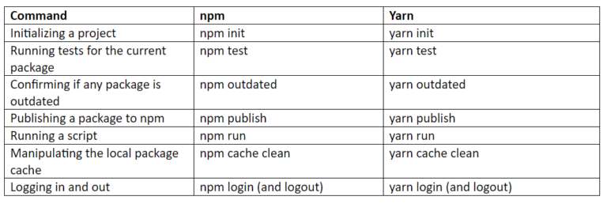
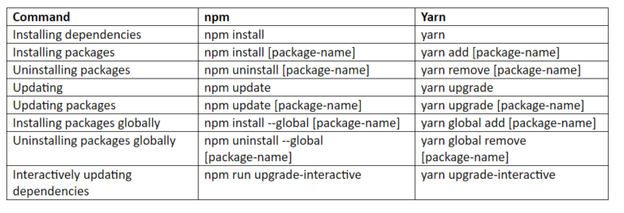

# What is npm?
* npm stands for `Node Package Manager`
* It is like Ivy (dependency manager) in JVM language. By the way, maven is build tool + dependency manager

## Commands
* Check installed packages
```
npm ls
```

* By default, Install all modules listed as dependencies in `package.json`
```
npm install
```

* Install a specific package
```
npm install web3
```

* How to update a dependency using npm ? 
  * Change `Package.json` and run `npm update`

## npm global and local installation? 
* Packages/dependencies are stored in `<user-directory>/npm` directory
```
npm install express -g
``` 

* Packages/dependencies are stored in local `node_modules` folder
```
npm install express
```

## `--save-dev` option
* Do users need to download your testing libraries as well? Maybe you use `jest` for testing and they use `mocha`. Do you want them to install jest as well? 

* When someone does, `npm i yourPackage` only the libraries required to `RUN` your library will be installed. 

* Other libraries you used to bundle your code with or testing and mocking will not be installed because you put them in devDependencies

# What is package.json?
* It is used to define the properties of a package

## version in package.json
* `^1.2.3` will match any `1.x.x` release including `1.3.0`, but will hold off on `2.0.0`
* `~1.2.3` will match all `1.2.x` versions but will miss `1.3.0`

## Do I commit the package-lock.json file? `Yes`
It will cause a lot of noise or conflict when seeing the diff. But the benefits are:

* Guarantee exact same version of every package
* It improves the installation process

We may use `^1.2.3` in your package.json, but we can't ensure each time `npm install` will pick up the same version in the dev machine and in the build server, especially those indirect dependency packages. `package-lock.json` will ensure that.

## Create package.json file
```
npm init
```

## Install packages described in package.json file
```
npm install
```

# Change npm registry
## check current registry
```
npm config list
```

## set registry
```
npm set registry https://registry.npmjs.org
```

## use private registry
```
npm install --registry http://localhost:4873
```

# What is `yarn`
* it is initially released by Facebook in 2016, is another popular package manager for the JavaScript programming language
* Yarn apppeared as an attempt to solve some of the problems with npm
  * mainly `performance` and `security`

## NPM Disadvantages
* There is a single npm registry of packages, which is unreliable in case of any performance issues
  * Yarn allows parallel packages installation
* Network is required to install packages
  * Yarn can install packages from the local cache
* Yarn has a cleaner input of CLI commands
* Yarn has more stars and more developers to maintain it

## Command Comparison



